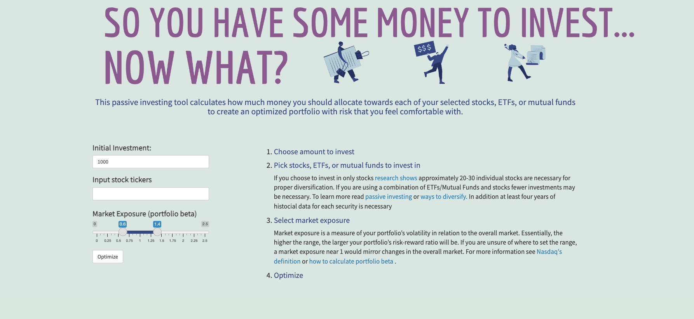

## Calculate optimal asset allocation for stocks, ETFs, & mutual funds. 

After taking some coursework in portfolio theory I was inspired to design an interface to more easily interact with the material. The program allows users to select the amount amount they want to invest, which stocks, exchanges, or funds they're interested in and the risk level of the portfolio measured by its beta. It then computes an optimal allocation with the additional constraint of no short selling.

